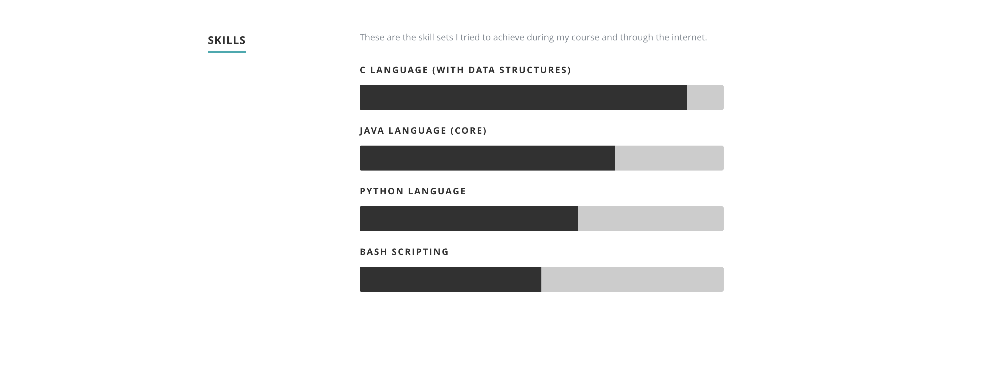

# CV-Website

This repository contains the source code for my previous CV-website. The [Link](https://sashuu6.github.io/CV-Website/) directs you to the website. The following image is the layout of the page.


## To change skill



```css
.c-language {
  	width: 90%;
  	-moz-animation: c-language 2s ease;
  	-webkit-animation: c-language 2s ease;
}

@-moz-keyframes c-language {
  0%   { width: 0px;  }
  100% { width: 90%;  }
}
```
To change the percentage, change width and 100% width.
eg: To change to 40%, do the following.

```css
.c-language {
  	width: 40%;
  	-moz-animation: c-language 2s ease;
  	-webkit-animation: c-language 2s ease;
}

@-moz-keyframes c-language {
  0%   { width: 0px;  }
  100% { width: 40%;  }
}